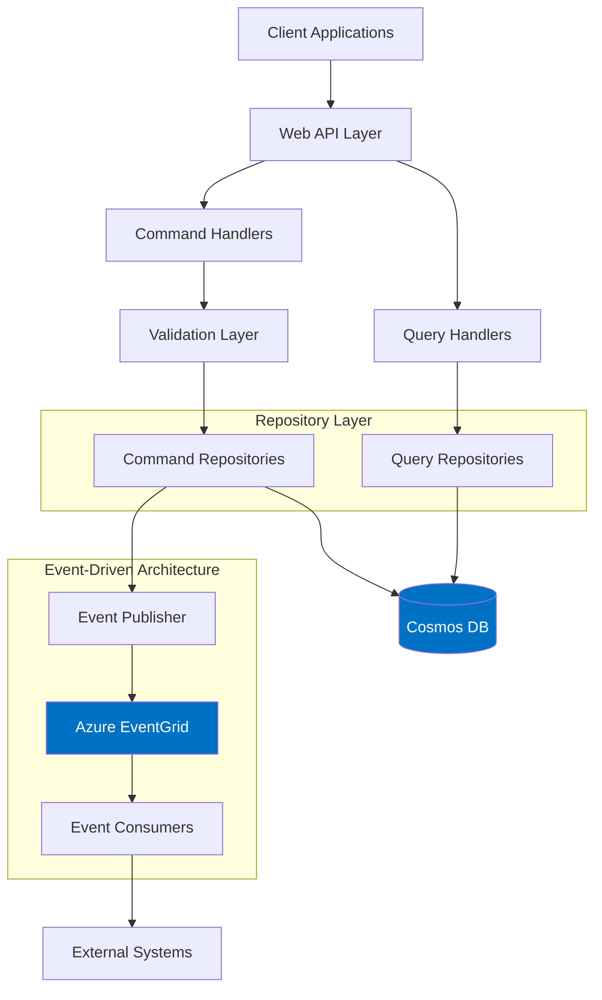
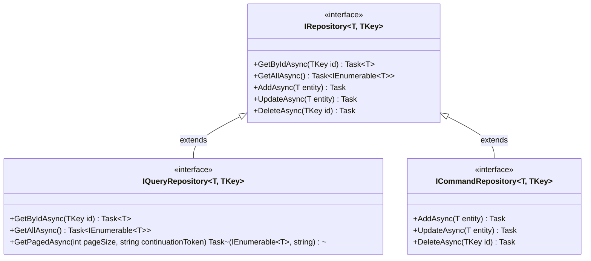
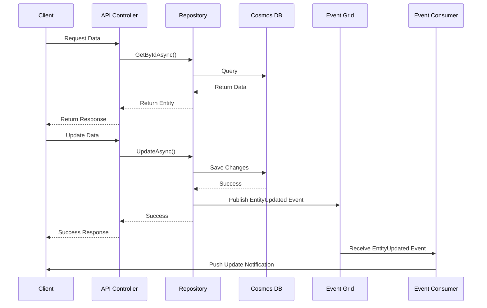
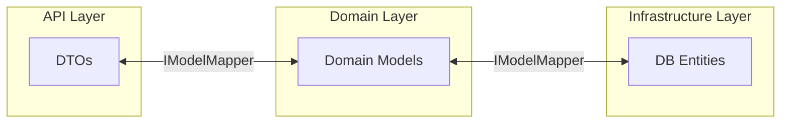
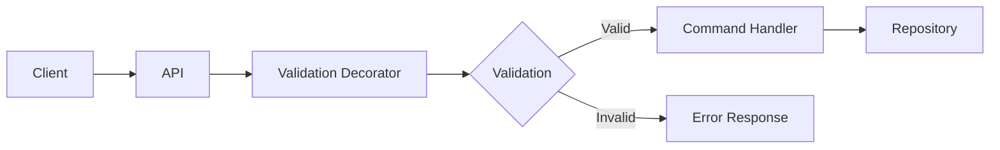
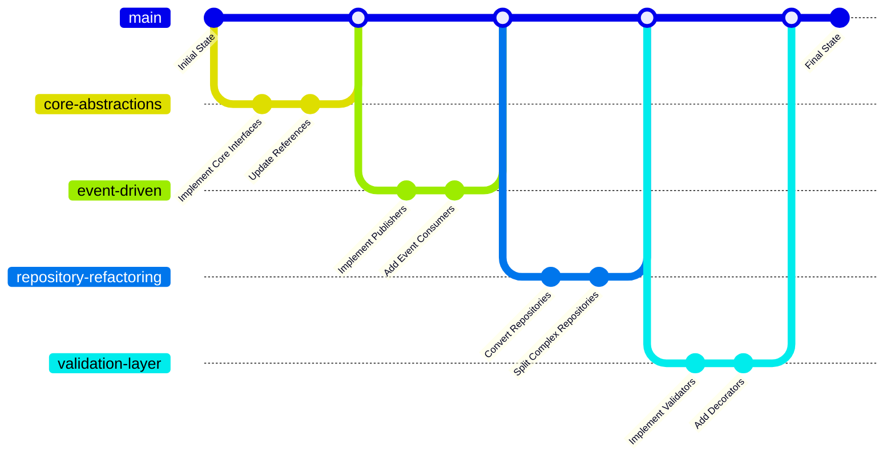

# Phoenix MarketData Platform Architecture Implementation Guide

## Overview

This guide explains how to implement the architectural changes for the Phoenix MarketData Platform as outlined in the requirements. The changes are designed to improve scalability, maintainability, and flexibility of the platform.

## Architecture Diagram



## Key Architectural Changes

### 1. Move to Event-Driven over Pure API

We've implemented an event-driven architecture using Azure EventGrid for publishing and consuming events:

- **IEventPublisher interface**: Defines the contract for publishing events
- **EventGridPublisher**: Implements IEventPublisher using Azure EventGrid
- **Repository integration**: Repositories can publish events when entities change

#### Event-driven Implementation Guidelines

- Use EventGridPublisher for broadcasting state changes
- Maintain standardized event schemas with versioning
- Follow CloudEvents spec for standardization
- Implement idempotent event consumers

**Example Implementation:**

```csharp
// Core event publisher interface
public interface IEventPublisher
{
    Task PublishAsync<T>(string eventType, T eventData) where T : class;
    Task PublishManyAsync<T>(string eventType, IEnumerable<T> events) where T : class;
}

// Azure EventGrid implementation
public class EventGridPublisher : IEventPublisher
{
    private readonly EventGridPublisherClient _client;
    private readonly ILogger<EventGridPublisher> _logger;

    public EventGridPublisher(EventGridPublisherClient client, ILogger<EventGridPublisher> logger)
    {
        _client = client;
        _logger = logger;
    }

    public async Task PublishAsync<T>(string eventType, T eventData) where T : class
    {
        try {
            // Create CloudEvent
            var cloudEvent = new CloudEvent(
                source: "/phoenix/marketdata",
                type: eventType,
                jsonSerializableData: eventData
            );

            await _client.SendEventAsync(cloudEvent);
            _logger.LogInformation("Published event {EventType}", eventType);
        }
        catch (Exception ex) {
            _logger.LogError(ex, "Failed to publish event {EventType}", eventType);
            throw;
        }
    }

    public async Task PublishManyAsync<T>(string eventType, IEnumerable<T> events) where T : class
    {
        // Implementation omitted for brevity
    }
}
```

**Reference Implementation:** [src/Phoenix.MarketData.Infrastructure/Events/EventGridPublisher.cs](src/Phoenix.MarketData.Infrastructure/Events/EventGridPublisher.cs)

### 2. Repository Layer Abstractions

We've defined clean repository abstractions:

- **IRepository<T, TKey>**: Base repository with common CRUD operations
- **IQueryRepository<T, TKey>**: Read-focused repository for query operations
- **ICommandRepository<T, TKey>**: Write-focused repository for command operations
- **CosmosRepository< T >**: Implementation using Azure Cosmos DB

#### Repository Implementation Guidelines

- Use the appropriate repository interface based on your needs
- Avoid "kitchen sink" repositories with too many methods
- Keep interfaces focused and cohesive
- Consider Command/Query separation for complex domains

**Command/Query Separation Diagram:**



**Example Implementation:**

```csharp
// Base repository interface
public interface IRepository<T, TKey> where T : class, IEntity<TKey>
{
    Task<T?> GetByIdAsync(TKey id);
    Task<IEnumerable<T>> GetAllAsync();
    Task AddAsync(T entity);
    Task UpdateAsync(T entity);
    Task DeleteAsync(TKey id);
}

// Query-specific repository
public interface IQueryRepository<T, TKey> : IRepository<T, TKey> where T : class, IEntity<TKey>
{
    Task<(IEnumerable<T> Items, string? ContinuationToken)> GetPagedAsync(
        int pageSize,
        string? continuationToken = null);

    Task<IEnumerable<T>> GetBySpecificationAsync(ISpecification<T> spec);
}

// Command-specific repository
public interface ICommandRepository<T, TKey> : IRepository<T, TKey> where T : class, IEntity<TKey>
{
    Task<T> AddAndPublishAsync(T entity);
    Task UpdateAndPublishAsync(T entity);
    Task DeleteAndPublishAsync(TKey id);
}
```

**Reference Implementation:** [src/Phoenix.MarketData.Core/Repositories/IRepository.cs](src/Phoenix.MarketData.Core/Repositories/IRepository.cs)

### 3. Dual Push/Pull Model

The repository implementations support both models:

- **Pull Model**: Traditional request-response pattern via repository methods
- **Push Model**: Event-based notifications when data changes
- **CosmosDbRepository**: Shows both models in action

#### Push/Pull Implementation Guidelines

- Use Pull model for synchronous requests
- Use Push model for reactive updates
- Don't force both models into a single abstraction unless it fits naturally
- Consider performance implications of each approach

**Push/Pull Flow Diagram:**



**Example Implementation:**

```csharp
// Repository with dual push/pull capability
public class CosmosRepository<T> : ICommandRepository<T, string> where T : BaseEntity
{
    private readonly Container _container;
    private readonly IEventPublisher _eventPublisher;

    // Constructor omitted for brevity

    // Pull model: Synchronous request-response
    public async Task<T?> GetByIdAsync(string id)
    {
        try
        {
            var response = await _container.ReadItemAsync<T>(
                id, new PartitionKey(id));
            return response.Resource;
        }
        catch (CosmosException ex) when (ex.StatusCode == HttpStatusCode.NotFound)
        {
            return null;
        }
    }

    // Push model: Update with event notification
    public async Task UpdateAndPublishAsync(T entity)
    {
        await _container.UpsertItemAsync(entity, new PartitionKey(entity.Id));

        // Publish event for subscribers
        await _eventPublisher.PublishAsync(
            $"{typeof(T).Name}Updated",
            entity);
    }
}
```

**Reference Implementation:** [src/Phoenix.MarketData.Infrastructure/Repositories/CosmosRepository.cs](src/Phoenix.MarketData.Infrastructure/Repositories/CosmosRepository.cs)

### 4. Explicit Domain <-> DTO <-> DB Layering

We've created mapping abstractions:

- **IModelMapper**: Interface for mapping between different object types
- Clear separation between domain models, DTOs, and DB entities

#### DDD Implementation Guidelines

- Keep domain models free of persistence concerns
- Use DTOs for API communication
- Use mapping layers to transform between types
- Consider AutoMapper for simple mappings

**Layering Diagram:**



**Example Implementation:**

```csharp
// Model mapper interface
public interface IModelMapper<TSource, TDestination>
{
    TDestination Map(TSource source);
    IEnumerable<TDestination> MapMany(IEnumerable<TSource> sources);
}

// Example implementation for mapping between domain and persistence
public class PriceDomainToEntityMapper : IModelMapper<PriceDomain, PriceEntity>
{
    public PriceEntity Map(PriceDomain source)
    {
        return new PriceEntity
        {
            Id = source.Id,
            Symbol = source.Symbol,
            Value = source.Price,
            Timestamp = source.Timestamp,
            Source = source.Provider,
            LastUpdated = DateTime.UtcNow
        };
    }

    public IEnumerable<PriceEntity> MapMany(IEnumerable<PriceDomain> sources)
    {
        return sources.Select(Map);
    }
}
```

**Reference Implementation:** [src/Phoenix.MarketData.Core/Mapping/IModelMapper.cs](src/Phoenix.MarketData.Core/Mapping/IModelMapper.cs)

### 5. Validation as Horizontal Layer

We've implemented validation as a cross-cutting concern:

- **IValidator< T >**: Core validation interface
- **ValidationCommandHandlerDecorator**: Decorator for command handlers

#### Validation Implementation Guidelines

- Validate at the edge of the system
- Use the decorator pattern for automatic validation
- Keep validation rules separate from business logic
- Return rich validation results with detailed errors

**Validation Flow Diagram:**



**Example Implementation:**

```csharp
// Validator interface
public interface IValidator<T>
{
    Task<ValidationResult> ValidateAsync(T instance);
}

// Validation result
public class ValidationResult
{
    public bool IsValid => !Errors.Any();
    public IList<ValidationError> Errors { get; } = new List<ValidationError>();
}

// Decorator implementation
public class ValidationCommandHandlerDecorator<TCommand> : ICommandHandler<TCommand>
    where TCommand : ICommand
{
    private readonly ICommandHandler<TCommand> _decoratedHandler;
    private readonly IValidator<TCommand> _validator;

    public ValidationCommandHandlerDecorator(
        ICommandHandler<TCommand> decoratedHandler,
        IValidator<TCommand> validator)
    {
        _decoratedHandler = decoratedHandler;
        _validator = validator;
    }

    public async Task HandleAsync(TCommand command)
    {
        var validationResult = await _validator.ValidateAsync(command);

        if (!validationResult.IsValid)
        {
            throw new ValidationException(validationResult.Errors);
        }

        await _decoratedHandler.HandleAsync(command);
    }
}
```

**Reference Implementation:** [src/Phoenix.MarketData.Core/Validation/ValidationCommandHandlerDecorator.cs](src/Phoenix.MarketData.Core/Validation/ValidationCommandHandlerDecorator.cs)

### 6-7. Extensibility and Shared Implementations

The architecture promotes:

- **Flexible abstractions**: Easy to extend or replace components
- **Shared implementations**: Common patterns in base classes
- **Composable components**: Mix and match as needed

### 8. Repository Visibility/Security

We've improved security:

- **IMarketDataSecretProvider**: Abstracts secret management
- **ISecretCache**: Optional caching for frequently accessed secrets
- **MarketDataSecretProvider**: Implementation using Azure Key Vault

#### Security Implementation Guidelines

- Use environment variables for local development
- Always retrieve secrets from secure stores
- Never commit credentials to source control
- Consider implementing secret rotation

**Example Implementation:**

```csharp
public interface IMarketDataSecretProvider
{
    Task<string> GetSecretAsync(string secretName);
    Task<IDictionary<string, string>> GetSecretsAsync(IEnumerable<string> secretNames);
}

public class KeyVaultSecretProvider : IMarketDataSecretProvider
{
    private readonly SecretClient _secretClient;
    private readonly ISecretCache _secretCache;

    public KeyVaultSecretProvider(
        SecretClient secretClient,
        ISecretCache secretCache = null)
    {
        _secretClient = secretClient;
        _secretCache = secretCache;
    }

    public async Task<string> GetSecretAsync(string secretName)
    {
        // Try cache first if available
        if (_secretCache != null)
        {
            var cachedSecret = await _secretCache.GetSecretAsync(secretName);
            if (!string.IsNullOrEmpty(cachedSecret))
            {
                return cachedSecret;
            }
        }

        // Get from Key Vault
        var response = await _secretClient.GetSecretAsync(secretName);
        var secretValue = response.Value.Value;

        // Cache the result if caching is enabled
        if (_secretCache != null)
        {
            await _secretCache.SetSecretAsync(secretName, secretValue);
        }

        return secretValue;
    }

    // GetSecretsAsync implementation omitted for brevity
}
```

**Reference Implementation:** [src/Phoenix.MarketData.Infrastructure/Security/KeyVaultSecretProvider.cs](src/Phoenix.MarketData.Infrastructure/Security/KeyVaultSecretProvider.cs)

## Migration Strategy

1. **Start with Core Abstractions**:

   - Begin by implementing the Core interfaces
   - Update existing code to use these interfaces

2. **Incremental Migration to Event-Driven**:

   - Implement event publishers first
   - Then add event consumers
   - Use the Strangler Pattern to replace functionality piece by piece

3. **Repository Layer Refactoring**:

   - Convert existing repositories to use the new abstractions
   - Split complex repositories into focused implementations

4. **Validation Layer Implementation**:
   - Implement validators for key entities
   - Apply validation decorators to command handlers

**Migration Process Diagram:**



## Additional Considerations

### Testing

- **Unit Testing**: Test each component in isolation
- **Integration Testing**: Test the interaction between components
- **Event Testing**: Verify event publishing and subscription
- **Mocking**: Use interfaces for effective mocking

**Reference Implementation:** [tests/Phoenix.MarketData.Infrastructure.Tests/Repositories/CosmosRepositoryTests.cs](tests/Phoenix.MarketData.Infrastructure.Tests/Repositories/CosmosRepositoryTests.cs)

### Observability

- Implement structured logging
- Add distributed tracing for event flows
- Monitor event queues and topics

### Performance

- Cache frequently accessed data
- Use asynchronous operations
- Implement retry policies for resilience

## Conclusion

This architectural approach provides a solid foundation for the Phoenix MarketData Platform. By implementing these changes incrementally, you can improve the scalability, maintainability, and flexibility of the system without disrupting existing functionality.
